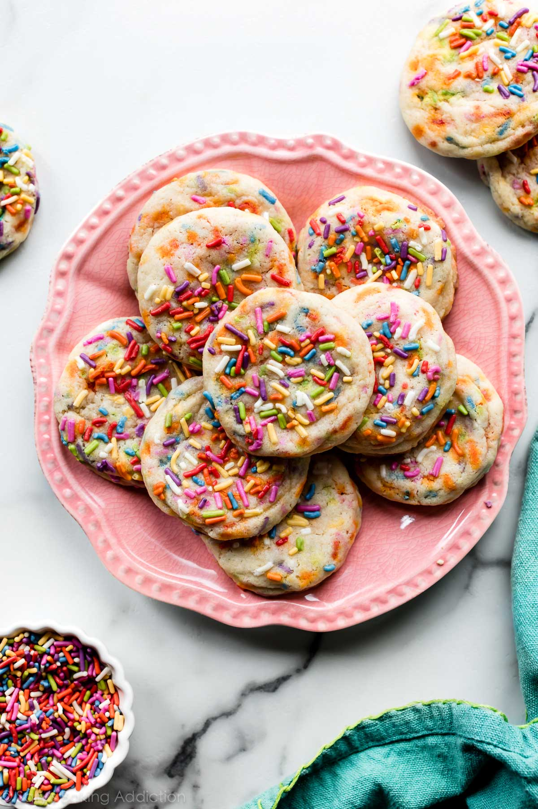

As we all know sprinkles are the best possible food source and if we could subsist on a diet of sprinkles alone that would be ideal.
One day we will make this a biological possibility, and until then we will continue consuming them at a reasonable level.

May I present: Sprinkle cookies.
They are a shortbread cookie, but a bit softer, with a number of colours somewhere in the range of 100s to 1000s.

## Ingredients

115g unsalted butter (room temperature)
150g granulated sugar
190g plain flour
1.5 tsp baking powder
0.25 t salt
1 egg
1 tsp vanilla extract
100g sprinkles + more for topping

## Instructions

1. Cream butter & sugar until pale and fluffy
2. Add egg and vanilla, beat on high for 1 minute
3. In a separate bowl, whisk flour, baking powder and salt
4. Add the dry ingredients and sprinkles to the wet ingredients, mix on low until combined
