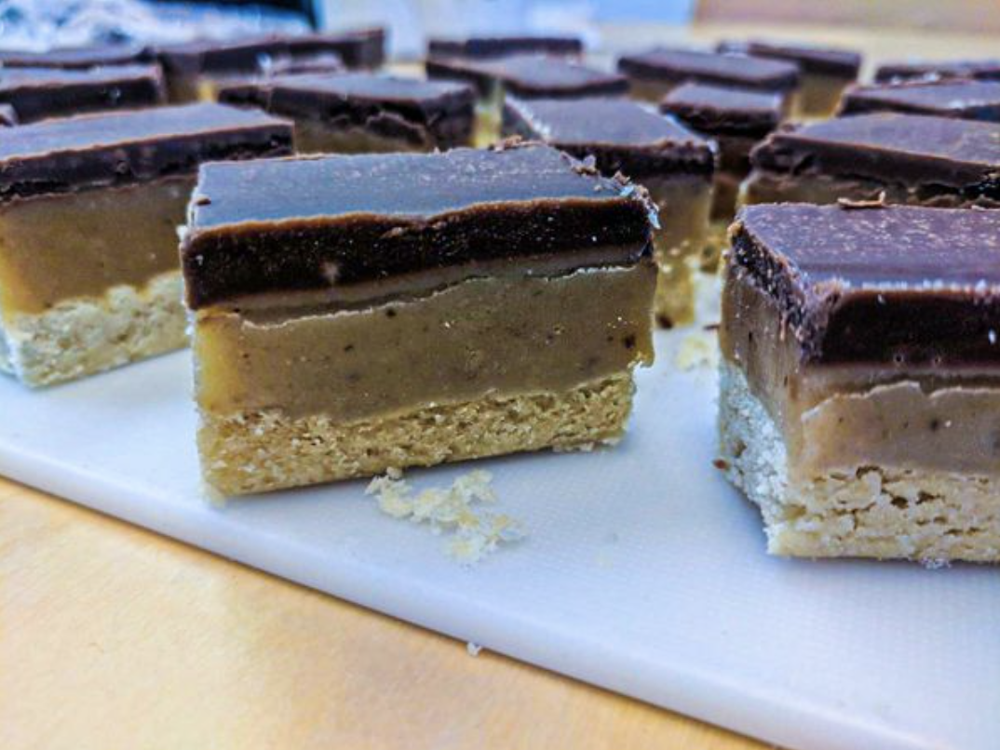

Millionaire's shortbread is caramel slice in Australia - although the ratios of caramel to choc are slightly different.

I find it is quite rewarding to make, and seems much more complicated than it is, especially after a few practices.

There are three components: shortbread, caramel & chocolate. I will be brief here but if you are interested, more verbose instructions are available where indicated:

[Shortybredy!](../shortbread)